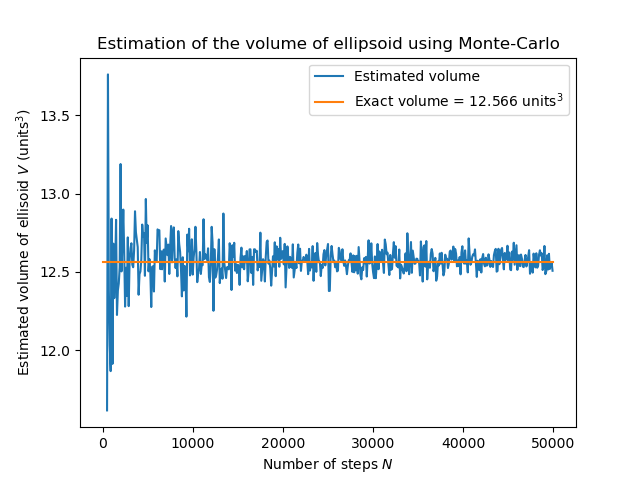
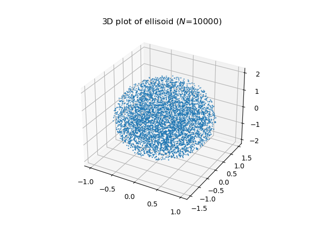

# Estimation of the volume of an ellisoid using Monte-Carlo

`ellipsoid.py` contains helper functions for estimating the volume of the ellisoid using Monte-Carlo (`estimate.py`) and generating the resultant 3D plot (`volume3d.py`)

## Plots

### Estimate of volume

### 3D Plot of ellipsoid

